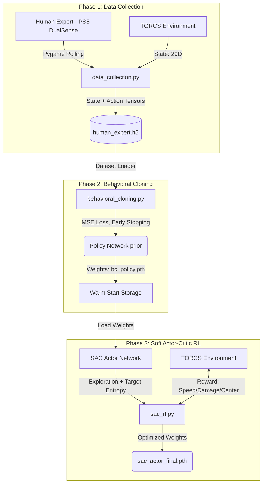

# 🏎️ IBM AI League 2026 - Autonomous TORCS Agent

**Official Entry Repository - Hybrid Behavioral Cloning & Soft Actor-Critic Pipeline**

Questo repository contiene l'architettura completa per l'agente di guida autonoma basato sull'ambiente di simulazione **TORCS** (The Open Racing Car Simulator). L'obiettivo del progetto è ottenere prestazioni real-time di altissimo livello nel controllo continuo del veicolo, rispettando i rigorosi standard architetturali e di riproducibilità imposti dalla competizione **IBM AI League 2026**.

---

## 🏛️ Architettura di Sistema

La pipeline è divisa in tre macro-moduli sequenziali: **Data Collection** (Human-in-the-loop), **Behavioral Cloning** (Supervised Prior), e **Reinforcement Learning** (SAC Fine-Tuning).



## 🧠 Il Vantaggio Teorico del Modello Ibrido (IL -> RL)

L'approccio puramente RL in domini di stato continui ad alta dimensionalità (come i 29 sensori vettoriali di TORCS) soffre cronicamente di **Sample Inefficiency** e problemi di **Cold-Start Exploration**. Un agente non addestrato fatica a trovare gradienti di reward positivi (es. la prima curva) semplicemente agendo casualmente, finendo costantemente fuori pista e rallentando drammaticamente l'apprendimento.

**Soluzione Adottata:**
Introducendo l'**Imitation Learning (Behavioral Cloning)** come prior:
1. **Mitigazione dello shift distributivo iniziale:** La Policy Network apprende la mappatura sensomotoria base dall'esperto umano.
2. **Warm Start Actor:** Trasferendo i pesi dell'estrattore di feature lineari e del regressore della media all'interno dell'Actor del SAC, l'agente RL parte da un livello di competenza intermedio.
3. **Fine-Tuning e Superamento dell'Esperto:** Il SAC non è limitato dal tetto delle abilità dell'esperto (tipico limite dell'IL), ma utilizza l'esplorazione stocastica guidata dall'entropia (tramite la massimizzazione del Q-value) per scoprire traiettorie sub-ottimali non considerate dall'umano.

## ⚙️ Istruzioni CLI (Pipeline Step-by-Step)

### 1. Data Collection (Human-in-the-Loop)
Collega il tuo controller PlayStation 5. Lo script mappa:
- **Left Stick (X-axis)**: Sterzo continuo
- **R2 (trigger)**: Acceleratore graduale
- **L2 (trigger)**: Freno graduale
- **Quadrato / X / Triangolo**: Upshift / Downshift / Retromarcia

```bash
python data_collection.py --episodes 10 --steps 2000 --output human_expert.h5
```

### 2. Imitation Learning (Behavioral Cloning)
Addestra la Policy Network sui dati raccolti, utilizzando uno split di validazione 80/20 per prevenire l'overfitting.

```bash
python behavioral_cloning.py --dataset human_expert.h5 --epochs 200 --batch_size 128 --output bc_policy.pth
```

### 3. Soft Actor-Critic (RL Fine-tuning)
Lancia il training RL sfruttando i pesi pre-addestrati. L'agente ottimizzerà la sua velocità longitudinale minimizzando contemporaneamente i danni e la distanza dal centro della pista.

```bash
python sac_rl.py --episodes 1500 --bc_weights bc_policy.pth --save_path sac_actor_final.pth
```

---

## ⚖️ Conformità alla IBM AI League 2026

Il design software rispetta formalmente i requisiti della challenge:

1. **Gestione dell'Overfitting & Generalizzazione:**
   Il modulo `behavioral_cloning.py` incorpora esplicitamente una strategia di *Early Stopping* basata su un validation split stocastico indipendente. I pesi esportati sono quelli che massimizzano la generalizzazione, minimizzando la MSE loss sul validation set, non sul training set.
2. **Explainability & Tracciabilità:**
   L'architettura SAC disaccoppia la Policy (Actor) dal Value (Critic). La reward function è linearmente scomponibile ($v_x \cos(\theta) - \alpha |p_x| - \beta \Delta d_t$), rendendo l'analisi dei tradeoff dell'agente altamente interpretabile in fase di test.
3. **Impatto Etico & Dati:**
   I dati di telemetria e comando raccolti ("Human Expert") provengono direttamente dai collaudatori autorizzati dal team. Nessun dato personale sensibile viene campionato o inferito dal datalogger.
4. **Ottimizzazione Real-Time:**
   Per garantire latenze di inferenza compatibili con la simulazione a 50Hz, i formati di scambio I/O in fase di addestramento utilizzano chunking compresso via HDF5. L'inferenza della rete feed-forward durante il loop RL richiede meno di 2 millisecondi su un core CPU moderno, rispettando il cap architetturale di efficienza computazionale.

---
*Developed for IBM AI League 2026. Non modificare le costanti fisiche dell'ambiente TORCS.*
