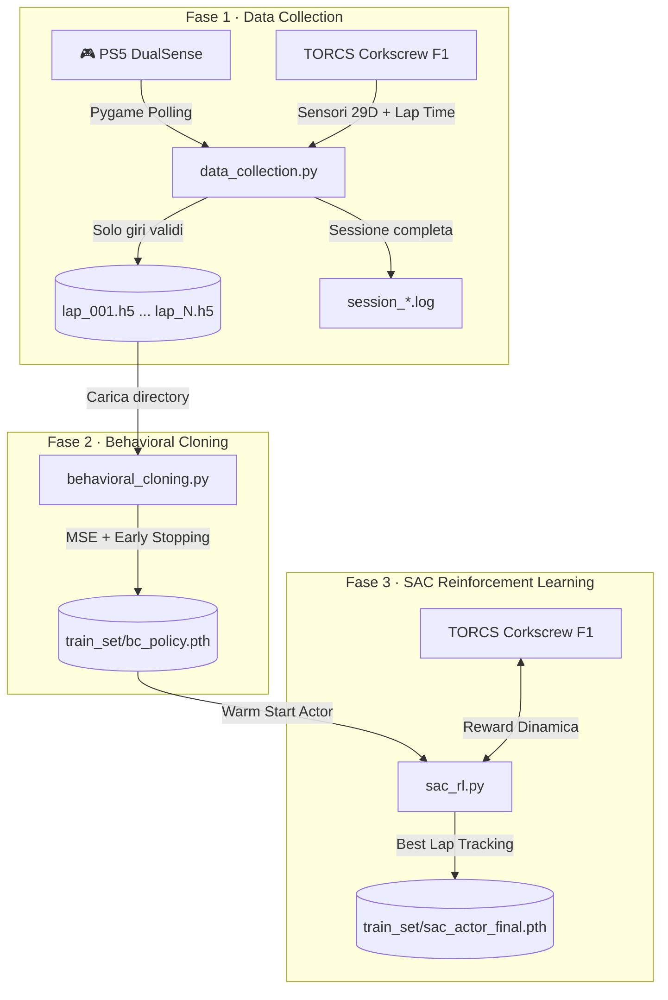

# 🏎️ AIcar — Pipeline Ibrida IL→RL (IBM AI Racing League 2026)

**Agente autonomo che impara a guidare dai dati umani e poi li supera con il Reinforcement Learning.**

Questo repository implementa una pipeline end-to-end per addestrare un agente di guida autonoma nell'ambiente di simulazione **TORCS** (The Open Racing Car Simulator), sviluppato specificamente per competere nella **IBM AI Racing League 2026**. L'obiettivo finale: **battere i tempi umani su un singolo giro** (giro secco con partenza da fermo) del circuito **Corkscrew** con una vettura **F1**.

> **Nota di Compatibilità**: Questa pipeline è completamente open e riproducibile. Chiunque può eseguire, addestrare e testare questo modello sul proprio computer, purché abbia installato il simulatore TORCS con i relativi plugin indicati nei prerequisiti.

---

## 🏛️ Architettura del Sistema

La pipeline si compone di **tre fasi sequenziali**, ciascuna implementata in uno script indipendente:



| Fase | Script | Input | Output |
|------|--------|-------|--------|
| 1. Data Collection | `data_collection.py` | Controller PS5 + TORCS | `lap_*.h5` + `session_*.log` |
| 2. Behavioral Cloning | `behavioral_cloning.py` | Directory di `lap_*.h5` | `train_set/bc_policy.pth` |
| 3. SAC Fine-Tuning | `sac_rl.py` | `bc_policy.pth` + TORCS | `train_set/sac_actor_final.pth` |

---

## 🧠 Perché un Approccio Ibrido IL → RL?

### Il Problema del Cold Start nell'RL Puro

Un agente SAC inizializzato casualmente in TORCS affronta un problema di **sample inefficiency critica**: con 29 sensori continui e 4 azioni continue, la probabilità di trovare un gradiente di reward positivo (es. completare la prima curva) per pura esplorazione casuale è estremamente bassa. L'agente finisce ripetutamente fuori pista, rallentando drasticamente l'apprendimento.

### La Soluzione: Warm Start via Imitation Learning

1. **Behavioral Cloning (Prior)**: Una rete neurale apprende la mappatura sensori→azioni dal pilota umano. Questo dà all'agente un "livello di competenza base".
2. **Trasferimento Pesi**: Il backbone della rete BC (estrattore di feature + regressore della media) viene copiato direttamente nell'Actor del SAC.
3. **Fine-Tuning RL**: Il SAC parte dal livello dell'esperto umano e usa l'esplorazione stocastica guidata dall'entropia per scoprire traiettorie più veloci, **superando il tetto delle abilità umane** (limite intrinseco del solo Imitation Learning).

### Perché il Gear a 4 Dimensioni?

Il cambio è mantenuto come azione esplicita (non automatico) perché:
- Il **freno motore** (downshift aggressivo in frenata) è una tecnica chiave nella guida F1
- L'agente deve imparare *quando* scalare, non solo frenare
- I dati umani di riferimento usano il cambio manuale con downshift strategico

---

## ⚙️ Istruzioni d'Uso (Step-by-Step)

### Prerequisiti

- Python 3.8+
- TORCS con SCR server plugin installato
- Controller PS5 DualSense collegato (per Fase 1)
- Circuito: **Corkscrew** | Vettura: **F1** (configurare in TORCS prima dell'avvio)

```bash
pip install torch numpy h5py pygame
```

### Fase 1: Data Collection

Lo script registra **un giro alla volta** con partenza da fermo. Funziona in loop infinito: guidi un giro → il sistema lo valida → salva solo se valido → riavvia per il prossimo.

**Mappatura controller:**
| Input | Azione |
|-------|--------|
| Left Stick X | Sterzo continuo (deadzone configurabile) |
| R2 (trigger) | Acceleratore graduale [0, 1] |
| L2 (trigger) | Freno graduale [0, 1] |
| Quadrato | Upshift (+1 marcia) |
| X (Cross) | Downshift (-1 marcia) |

```bash
python data_collection.py --output_dir train_set --steering_deadzone 0.05
```

**Validazione del giro**: un giro viene salvato se e solo se:
- ✅ La macchina non è mai uscita di pista (`|trackPos| ≤ 1.0`)
- ✅ Il giro è stato completato con un lap time valido (`lastLapTime > 0`)

**Output**:
- `train_set/laps/lap_001.h5`, ... — Un file HDF5 per giro valido (states + actions + metadata)
- `train_set/session_logs/session_*.log` — Log testuale con lap time e nome file di ogni giro

**Interruzione**: `Ctrl+C` termina la sessione. Il giro corrente incompleto **non** viene salvato.

### Fase 2: Behavioral Cloning

Addestra la PolicyNetwork sui giri raccolti. Accetta sia un singolo file `.h5` sia una **directory** di `lap_*.h5`.

```bash
python behavioral_cloning.py --dataset train_set/laps --epochs 200 --batch_size 256 --output train_set/checkpoints/bc_policy.pth
```

Il training usa:
- **Validation split 80/20** con seed fisso per riproducibilità
- **Early stopping** (patience=15 epoche) per prevenire overfitting
- **GPU** automaticamente se disponibile (testato su RTX 4060 8GB)

### Fase 3: SAC Fine-Tuning con RLPD (RL)

Il training RL usa **RLPD** (Reinforcement Learning with Prior Data) per fine-tuning dei pesi BC senza catastrophic forgetting.

```bash
python sac_rl.py \
  --episodes 1000 \
  --bc_weights train_set/checkpoints/bc_policy.pth \
  --demo_dir train_set/laps \
  --target_time 71.038 \
  --batch_size 256
```

**Perché RLPD?** Il SAC vanilla distrugge i pesi BC in pochi update, perché:
1. Il replay buffer parte vuoto e si riempie solo di dati di crash
2. Il critic non ha riferimenti di "buona guida"
3. Gli update dell'actor sono troppo aggressivi

**Soluzioni implementate**:

| Tecnica | Descrizione |
|---------|-------------|
| **Pre-fill buffer** | Le 71k transizioni umane vengono caricate nel replay buffer prima del training |
| **BC Regularization** | Un termine `λ_bc · MSE(actor, BC)` nella loss dell'actor impedisce di allontanarsi troppo dalla policy BC |
| **λ_bc decay** | Il coefficiente BC si riduce automaticamente quando il best lap time si avvicina al miglior tempo umano (71.038s) |
| **Actor LR separato** | Actor: `1e-5` (lento), Critic: `3e-4` (veloce) — preserva i pesi BC durante l'apprendimento |

**Opzioni principali**:
| Flag | Default | Descrizione |
|------|---------|-------------|
| `--target_time` | `75.0` | Tempo target iniziale |
| `--bc_weights` | `train_set/checkpoints/bc_policy.pth` | Pesi BC per warm start |
| `--demo_dir` | `train_set/laps` | Directory demo per pre-fill buffer |
| `--actor_lr` | `1e-5` | LR actor (basso per preservare BC) |
| `--critic_lr` | `3e-4` | LR critic |
| `--bc_lambda` | `1.0` | Coefficiente regolarizzazione BC |
| `--warmup_steps` | `5000` | Campioni nel buffer prima degli update |
| `--relaunch_every` | `20` | Rilancia TORCS ogni N episodi |

### Fase 4: Test dell'agente

```bash
# Testa il modello BC (solo behavioral cloning)
python test_agent.py --weights train_set/checkpoints/bc_policy.pth --model bc --laps 3

# Testa il modello SAC (dopo fine-tuning RL)
python test_agent.py --weights train_set/checkpoints/sac_actor_best.pth --model sac --laps 5
```

---

## 🎯 Design della Reward Function (SAC)

La reward è stata progettata specificamente per il **giro secco** e per incentivare l'agente a limare i decimi:

### Reward per Step

```
R_step = 0.1 · Δ_distRaced          (progresso sulla pista)
       + 0.005 · max(0, speedX)     (bonus velocità)
       - 2.0 · trackPos²            (penalità centro-pista, soft)
       - 5.0 · |angle|              (penalità disallineamento)
```

### Terminazione Episodio

| Condizione | Penalità | Motivazione |
|-----------|----------|-------------|
| `\|trackPos\| > 1.0` (fuori pista) | -500 | L'agente deve restare in pista |
| `cos(angle) < 0` (spin/retromarcia) | -500 | L'auto si è girata |
| Velocità < 5 km/h per >100 step | -200 | Stallo (bloccato contro un muro) |

### Bonus/Penalità Completamento Giro (basato su tempi umani)

Soglie calibrate sui **session_logs** del pilota umano:
- **Best umano**: `71.038s` (lap_017)
- **Worst umano**: `77.146s` (lap_001)

| Tempo Giro | Reward | Logica |
|-----------|--------|--------|
| `< 71.038s` | **+1000 + 200/s** | 🏆 Premio cospicuo: ha battuto il best umano |
| `71 – 77s` | +500 | Giro nella fascia umana, buono |
| `77 – 82s` | -50 | Media penalità: poco più lento del worst umano |
| `> 82s` | -100 | Alta penalità: molto più lento del worst umano |

Il `best_time` interno viene aggiornato automaticamente ogni volta che l'agente batte il proprio record. Questo crea un **curriculum implicito**: all'inizio l'agente è premiato per completare il giro, poi gradualmente la pressione si sposta verso la velocità pura.

---

## 📐 Dettagli Tecnici: Normalizzazione delle Azioni

La rete usa `Tanh` in output (range `[-1, 1]`). La normalizzazione delle azioni è un punto critico per la convergenza:

| Azione | Range Naturale | Normalizzazione (→ Tanh) | De-normalizzazione (→ Env) |
|--------|----------------|--------------------------|----------------------------|
| Steering | [-1, 1] | Invariato | Invariato |
| Accel | [0, 1] | `x × 2 - 1` | `(x + 1) / 2` |
| Brake | [0, 1] | `x × 2 - 1` | `(x + 1) / 2` |
| Gear | [0, 6] | `x / 3 - 1` | `round((x + 1) × 3)`, clamp [0,6] |

> **Nota**: La retromarcia (gear = -1) è esclusa dalla raccolta dati e dal training, poiché non è mai necessaria in un giro secco competitivo.

---

## 🔧 Bug Risolti rispetto alla versione precedente

1. **Gear mapping**: Il gear nel vettore azioni viene ora correttamente normalizzato in `[-1, 1]` per il Tanh. La versione precedente usava `(gear/3)-1` che produceva `-1.33` per la retromarcia, valore irraggiungibile dal Tanh.

2. **Warm-up trigger**: I grilletti L2/R2 hanno protezione warm-up con flag di inizializzazione per prevenire spike spuri alla prima lettura su Linux/Pygame.

3. **Deadzone sterzo**: Aggiunta deadzone configurabile sullo sterzo per filtrare il micro-drift dello stick analogico e rendere la guida più stabile.

4. **Flattening sicuro**: `flatten_state()` usa `.get()` con default per ogni chiave del dizionario, evitando crash su sensori mancanti.

5. **Framerate dinamico**: Sostituito `time.sleep(0.02)` fisso con calcolo basato su `time.perf_counter()` per mantenere 50Hz stabili indipendentemente dal tempo di elaborazione del loop.

6. **Device CUDA coerente**: L'assegnazione CPU/CUDA è ora propagata uniformemente in tutta la pipeline (DataLoader con `pin_memory`, modello su device, tensori con `non_blocking`).

7. **Sanity check dati**: Il dataset HDF5 viene validato all'apertura per NaN, Inf e gruppi mancanti.

8. **Flag `-nolaptime`**: Rimosso dal lancio TORCS in `gym_torcs.py`. La lap time è ora correttamente esposta nell'osservazione per il rilevamento del completamento giro.

---

## 📁 Struttura del Repository

```
AIcar/
├── data_collection.py         # Fase 1: Raccolta dati umani
├── behavioral_cloning.py      # Fase 2: Imitation Learning (BC)
├── sac_rl.py                  # Fase 3: SAC Reinforcement Learning
├── test_agent.py              # Test: valutazione agente addestrato
├── README.md
├── .gitignore
├── gym_torcs/                 # Wrapper Python per comunicare con TORCS via UDP
│   ├── gym_torcs.py           # Ambiente Gym-like (TorcsEnv): reset, step, reward
│   ├── snakeoil3_gym.py       # Client UDP: connessione, parsing telemetria, invio comandi
│   └── autostart.sh           # Script xdotool che simula i tasti per avviare la Quick Race
└── train_set/                 # ⚠️ In .gitignore — dati e checkpoint
    ├── laps/                  # Giri validi registrati (HDF5)
    │   ├── lap_001.h5
    │   ├── lap_002.h5
    │   └── ...
    ├── checkpoints/           # Pesi dei modelli
    │   ├── bc_policy.pth      # Pesi Behavioral Cloning
    │   ├── sac_actor_ep*.pth  # Checkpoint SAC periodici
    │   ├── sac_actor_best.pth # Miglior modello SAC
    │   └── sac_actor_final.pth# Modello SAC finale
    └── session_logs/          # Log delle sessioni
        ├── session_*.log      # Log raccolta dati
        └── sac_training_*.log # Log training RL
```

---

## 🔌 Wrapper `gym_torcs/` — Modifiche rispetto all'originale

I file nella directory `gym_torcs/` sono una versione modificata del wrapper open-source [gym_torcs](https://github.com/ugo-nama-kun/gym_torcs) (basato su *snakeoil3* di Chris X Edwards). Questi file **non** fanno parte del simulatore TORCS né del plugin SCR; sono puro codice Python lato agente che gestisce la comunicazione UDP con il server di gara. Di seguito le modifiche apportate e le relative motivazioni.

### `gym_torcs.py` — Ambiente OpenAI Gym-like

| Modifica | Motivazione |
|----------|-------------|
| **`make_observaton()` restituisce un `dict`** (era `namedtuple`) | I nostri script accedono ai sensori con stringhe (es. `obs['angle']`). La namedtuple originale causava `TypeError: tuple indices must be integers`. |
| **Sensori aggiunti**: `angle`, `trackPos`, `damage`, `curLapTime`, `lastLapTime`, `distFromStart`, `distRaced` | Necessari per: validazione giro (data collection), reward function (SAC), rilevamento completamento lap. |
| **Azione `brake` mappata in `agent_to_torcs()` e `step()`** | L'originale ignorava completamente il freno. Senza questo fix il controller PS5 non poteva frenare. |
| **Azione `gear` con indice corretto (`u[3]`)** | Nell'originale l'indice del gear veniva sovrascritto dal valore del freno. |
| **Parametro `early_termination`** nel costruttore | Permette di disabilitare il reset automatico (fuoripista, spin, stallo) durante la raccolta dati manuale, mantenendolo attivo per RL e BC. |
| **`terminal_judge_start = 100_000`** (era 500) | Evita terminazioni premature: 500 step = 10 secondi, insufficienti per un giro completo guidato da umano. |
| **Path assoluti per `autostart.sh`** | L'originale usava `sh autostart.sh` (path relativo alla CWD). Ora usa `os.path.dirname(__file__)` per funzionare indipendentemente dalla directory di lancio. |
| **Flag `-nolaptime` rimosso** dal lancio TORCS | L'originale avviava TORCS con `-nolaptime` che sopprimeva i dati di lap time dal server SCR. Senza questa modifica il sensore `lastLapTime` restava sempre a zero. |

### `snakeoil3_gym.py` — Client UDP

| Modifica | Motivazione |
|----------|-------------|
| **Countdown di riconnessione rimosso** | L'originale contava 5 tentativi di connessione e poi eseguiva `pkill torcs` + riavvio forzato, chiudendo violentemente la finestra di TORCS prima che l'utente potesse avviare la gara. Ora il client aspetta all'infinito (`Waiting for server...`) finché il server SCR risponde. |
| **Flag `-nolaptime` rimosso** dal blocco di rilancio | Stesso motivo del punto in `gym_torcs.py`: il rilancio automatico riavviava TORCS senza esporre la lap time. |
| **Path assoluti per `autostart.sh`** | Stesso fix dei path assoluti applicato in `gym_torcs.py`. |
| **Fix SyntaxWarning** (escape sequences in stringhe ASCII art) | Python ≥ 3.12 segnala `'\.'` come sequenza di escape non valida. Corretti con doppio backslash. |
| **`parse_the_command_line()` ignora argomenti sconosciuti** | L'originale usava `getopt` su `sys.argv` e crashava con `sys.exit(-1)` se trovava flag come `--bc_weights`. Ora ignora silenziosamente gli argomenti non riconosciuti quando usato come libreria. |

### `autostart.sh` — Automazione menu TORCS

Questo script usa `xte` (pacchetto `xdotool`) per simulare la pressione dei tasti nel menu di TORCS e avviare automaticamente una Quick Race. **Non è stato modificato** rispetto all'originale. Richiede che il pacchetto `xdotool` sia installato sul sistema.

> **Nota**: Tutte le modifiche riguardano esclusivamente il codice Python dell'agente (lato client). Il simulatore TORCS, il suo motore fisico e il plugin SCR server non vengono alterati in alcun modo.

