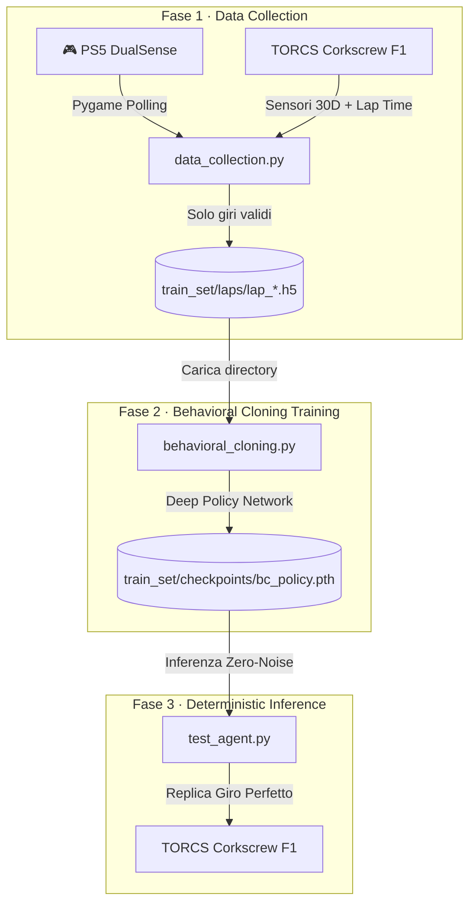

# 🏎️ AIcar — Behavioral Cloning Architecture (IBM AI Racing League 2026)

**Agente autonomo che impara a replicare il "giro perfetto" tramite Behavioral Cloning (BC).**

Questo repository implementa una pipeline end-to-end per addestrare un agente di guida autonoma nell'ambiente di simulazione **TORCS** (The Open Racing Car Simulator). L'obiettivo: **fittare perfettamente i dati esperti** per produrre una policy deterministica capace di completare un giro di qualifica pulito (senza collisioni o track-cut) sul circuito **Corkscrew** con una vettura **F1**.

---

## 🏛️ Architettura del Sistema

La pipeline è stata semplificata per eliminare la complessità del Reinforcement Learning, affidandosi a un'architettura deep di **Behavioral Cloning** capace di catturare ogni sfumatura della guida esperta.



| Fase | Script | Descrizione |
|------|--------|-------------|
| 1. Data Collection | `data_collection.py` | Raccolta di giri ideali guidati da un umano (esperto). |
| 2. BC Training | `behavioral_cloning.py` | Addestramento di una rete neurale profonda per imitare lo stato → azione dell'esperto. |
| 3. Test & Eval | `test_agent.py` | Esecuzione deterministica del modello per validare la replicabilità del giro. |

---

## 🧠 Filosofia del Progetto: Pure Behavioral Cloning

A differenza degli approcci ibridi, questo progetto punta sulla **massima fedeltà ai dati esperti**. Invece di esplorare traiettorie casuali tramite RL, l'agente utilizza una **Deep Policy Network** (4 layer nascosti, 30D → 512D) per mappare esattamente ogni sensore alla risposta corretta del pilota.

### Punti di forza della pipeline BC:
1. **Stabilità Assoluta**: Nessun rischio di *catastrophic forgetting* o divergenza tipica del RL.
2. **Determinismo**: A parità di stato iniziale, l'agente produrrà sempre la stessa traiettoria ideale.
3. **Efficienza**: Il training richiede pochi minuti su GPU anziché ore di interazione con il simulatore.

---

## ⚙️ Istruzioni d'Uso (Step-by-Step)

### 1. Raccolta Dati (Data Collection)
Registra almeno **10-20 giri puliti** (senza uscire di pista). I giri vengono salvati automaticamente solo se completati correttamente.

```bash
# Esempio con controller PS5
python data_collection.py --output_dir train_set --device controller
```

### 2. Addestramento (Training)
Lancia lo script `train_all.sh` per avviare l'addestramento della rete neurale sui dati esperti attualmente presenti nella cartella `laps/`.

```bash
./train_all.sh
```

Lo script applica internamente delle **Loss Pesate** per garantire la precisione:
- **Steer Curve Weight (5x)**: Forza la precisione millimetrica in curva.
- **Speed-Weighted Loss (10x)**: Garantisce partenze perfette e gestione ottimale delle marce basse.
- **Early Stopping**: Ferma il training basandosi sulla validation loss per evitare l'overfitting.

### 3. Test Deterministico (Inference)
Valuta l'agente in modalità rigorosamente deterministica (zero rumore).

```bash
python test_agent.py --weights train_set/checkpoints/bc_policy.pth --laps 3
```

---

## 📁 Struttura del Repository

```
AIcar/
├── data_collection.py         # Fase 1: Raccolta dati umani
├── behavioral_cloning.py      # Fase 2: Training della Deep Policy
├── test_agent.py              # Fase 3: Inferenza deterministica
├── train_all.sh               # 🚀 Script unico per il training
├── stop_training.sh           # 🛑 Ferma i processi attivi
├── monitor.sh                 # 📊 Monitoraggio status training
├── README.md
├── gym_torcs/                 # Wrapper Python per TORCS
└── train_set/                 # Dati e Checkpoint (HDF5, PTH)
```

---

## 🔧 Dettagli Tecnici: Deep Policy Network

La rete è stata potenziata per gestire la complessità del circuito Corkscrew:
- **Input**: 30 sensori (Angolo, TrackPos, Speed, RPM, Distanza, 19 Track Lasers).
- **Architettura**: 4 Layer lineari (256, 512, 512, 256) con **LayerNorm** e attivazioni **ReLU**.
- **Output**: 4 azioni continue via **Tanh** (Steer, Accel, Brake, Gear).
- **Optimizer**: Adam con Learning Rate adattivo e Weight Decay per la regolarizzazione.

---

**IBM AI Racing League 2026** — *Precision Driving through Behavioral Cloning.*
