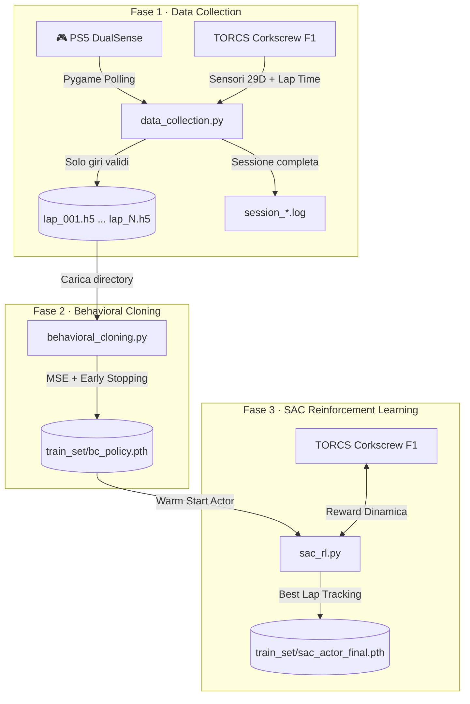
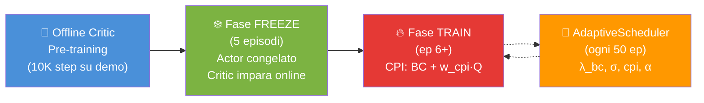

# 🏎️ AIcar — Pipeline Ibrida IL→RL (IBM AI Racing League 2026)

**Agente autonomo che impara a guidare dai dati umani e poi li supera con il Reinforcement Learning.**

Questo repository implementa una pipeline end-to-end per addestrare un agente di guida autonoma nell'ambiente di simulazione **TORCS** (The Open Racing Car Simulator), sviluppato specificamente per competere nella **IBM AI Racing League 2026**. L'obiettivo finale: **battere i tempi umani su un singolo giro** (giro secco con partenza da fermo) del circuito **Corkscrew** con una vettura **F1**.

> **Nota di Compatibilità**: Questa pipeline è completamente open e riproducibile. Chiunque può eseguire, addestrare e testare questo modello sul proprio computer, purché abbia installato il simulatore TORCS con i relativi plugin indicati nei prerequisiti.

---

## 🏛️ Architettura del Sistema

La pipeline si compone di **tre fasi sequenziali**, ciascuna implementata in uno script indipendente:



| Fase | Script | Input | Output |
|------|--------|-------|--------|
| 1. Data Collection | `data_collection.py` | Controller PS5 + TORCS | `lap_*.h5` + `session_*.log` |
| 2. Behavioral Cloning | `behavioral_cloning.py` | Directory di `lap_*.h5` | `train_set/bc_policy.pth` |
| 3. SAC Fine-Tuning | `sac_rl.py` | `bc_policy.pth` + TORCS | `train_set/sac_actor_final.pth` |

---

## 🧠 Perché un Approccio Ibrido IL → RL?

### Il Problema del Cold Start nell'RL Puro

Un agente SAC inizializzato casualmente in TORCS affronta un problema di **sample inefficiency critica**: con 29 sensori continui e 4 azioni continue, la probabilità di trovare un gradiente di reward positivo (es. completare la prima curva) per pura esplorazione casuale è estremamente bassa. L'agente finisce ripetutamente fuori pista, rallentando drasticamente l'apprendimento.

### La Soluzione: Warm Start via Imitation Learning

1. **Behavioral Cloning (Prior)**: Una rete neurale apprende la mappatura sensori→azioni dal pilota umano. Questo dà all'agente un "livello di competenza base".
2. **Trasferimento Pesi**: Il backbone della rete BC (estrattore di feature + regressore della media) viene copiato direttamente nell'Actor del SAC.
3. **Fine-Tuning RL**: Il SAC parte dal livello dell'esperto umano e usa l'esplorazione stocastica guidata dall'entropia per scoprire traiettorie più veloci, **superando il tetto delle abilità umane** (limite intrinseco del solo Imitation Learning).

### 🎯 Strategia dei Dati Separati: Ideali vs Diversificati

La nostra pipeline implementa una **separazione strategica dei dati di addestramento** per massimizzare la stabilità del warm-start e la robustezza dell'apprendimento per rinforzo:

```
               [ DATI RACCOLTI ]
               /               \
              /                 \
  [ Giri Completi Ideali ]    [ Curve con Linee Alternative ]
  (Traiettoria e guida 100%   (Manovre errate + RECUPERO dell'auto)
   pulite e perfette)                    |
              |                          |
              v                          v
  [ Fase 2: Behavioral Cloning ]   [ Fase 3: SAC Replay Buffer ]
  (Impara una guida di base        (Prefill completo: impara sia
   lineare, solida e senza sbandate)  la linea ideale che il recupero)
```

- **Perché il Behavioral Cloning (Fase 2) vuole solo Dati Perfetti?**
  L'addestramento supervisionato (BC) minimizza l'errore quadratico medio (MSE). Se includessimo traiettorie "sporche" o sbandate nel dataset di addestramento del BC, la rete calcolerebbe una media matematica di questi comportamenti divergenti (*multi-modal policy problem*), portando a un modello di base instabile che sbanda e va fuori pista da solo. Il BC deve quindi imparare **esclusivamente la linea ideale perfetta**.
  
- **Perché il Replay Buffer del SAC (Fase 3) vuole Sia Dati Perfetti che di Recupero?**
  Durante il Reinforcement Learning, l'agente deve esplorare la pista. Se devia leggermente dalla traiettoria ideale, deve sapere come correggersi. Prefilando il Replay Buffer con gli snippet di curve diversificate (`lap_curve_diverse_*`), insegniamo al Critic del SAC che trovarsi fuori traiettoria ma effettuare una **manovra di recupero corretta** porta a una reward elevata, offrendo all'Actor un gradiente di miglioramento immediato senza costringerlo a sbattere a muro migliaia di volte prima di capire come salvarsi.
  
  > **Architettura Stratificata (Data Mixing):** Per evitare che un dataset sbilanci il Replay Buffer a sfavore dei tratti lineari (catastrophic forgetting), il campionamento dei mini-batch a livello di Dataloader è stratificato. Viene mantenuto il dataset originale come base al **75% delle transizioni** nel batch, iniettando le curve specifiche come expert injection al **25%**. Questo preserva le dinamiche rettilinee garantendo al contempo sufficienti gradienti per le manovre di svolta.

### Perché il Gear a 4 Dimensioni?

Il cambio è mantenuto come azione esplicita (non automatico) perché:
- Il **freno motore** (downshift aggressivo in frenata) è una tecnica chiave nella guida F1
- L'agente deve imparare *quando* scalare, non solo frenare
- I dati umani di riferimento usano il cambio manuale con downshift strategico

---

## ⚙️ Istruzioni d'Uso (Step-by-Step)

### Prerequisiti

- Python 3.8+
- TORCS con SCR server plugin installato
- Controller PS5 DualSense collegato (per Fase 1)
- Circuito: **Corkscrew** | Vettura: **F1** (configurare in TORCS prima dell'avvio)

```bash
pip install torch numpy h5py pygame
```

### Fase 1: Data Collection (Sistema di Raccolta Curve & Traiettorie Diversificate)

Lo script registra **un giro alla volta** con partenza da fermo e supporta due distinte modalità di raccolta dei dati. Offre un **rilevatore geometrico di curva** brevettato che analizza la strada in tempo reale anziché basarsi sullo sterzo del pilota, prevenendo falsi positivi causati da micro-correzioni in rettilineo.

#### 🎮 Parametri e Modalità di Raccolta
```bash
# Esempio 1: Raccolta Giri Ideali usando il controller PS5 (default)
python data_collection.py --output_dir train_set --mode ideal --device controller

# Esempio 2: Raccolta Traiettorie Diversificate usando la TASTIERA
python data_collection.py --output_dir train_set --mode diverse --device keyboard
```

- `--device controller` (default): Usa il controller PS5 DualSense.
- `--device keyboard`: Usa la tastiera (WASD + Frecce). Apre una piccola finestra nera denominata `"Input Focus"`. **Mantieni il focus su tale finestra affinché Pygame possa registrare i tasti premuti.**
- `--mode ideal` (default): Rappresenta la guida sulla linea ideale. All'arrivo del giro pulito, salva **sia il giro completo** in `laps/` che **gli snippet delle curve** in `laps/curves/`.
- `--mode diverse`: Ideale per arricchire il dataset delle curve. Il pilota può guidare intenzionalmente linee diverse (es. traiettorie larghe o strette in curva), mantenendosi però **rigorosamente dentro la pista** (`abs(trackPos) <= 1.0`). All'arrivo, salva **solo** gli snippet delle curve in `laps/curves/` (evitando di inquinare i giri completi ideali usati nel Behavioral Cloning con traiettorie sub-ottimali).

#### 🗺️ Algoritmo di Rilevamento Geometrico delle Curve
Per evitare che le correzioni di traiettoria del pilota umano in rettilineo vengano scambiate per curve, il sistema analizza la geometria della pista tramite i 19 range finder del sensore `track`:
1. **Visuale Frontale Ridotta**: Se la distanza misurata straight-ahead (`track[9]`) scende sotto i `130` metri, significa che la pista si sta chiudendo (la vettura si avvicina al muro esterno della curva).
2. **Spostamento dell'Apice (Apex Shift)**: In rettilineo il sensore più lungo è sempre il 9 (centrale). In curva, la via di fuga si sposta a destra o sinistra, facendo sì che l'indice con valore massimo sia diverso da 9.
3. **Asimmetria Profilo**: Se la somma delle distanze a sinistra `track[0:9]` differisce significativamente da quella a destra `track[10:19]`, la strada sta curvando.
4. **Frenate/Tornanti Ciechi**: Se la visuale frontale scende sotto i `60` metri, la curva è rilevata istantaneamente.

#### ⌨️ Mappatura Controlli di Guida

| Dispositivo | Input | Azione |
|-------------|-------|--------|
| **Controller PS5** | Left Stick X | Sterzo continuo (deadzone configurabile) |
| | R2 (trigger) | Acceleratore graduale [0, 1] |
| | L2 (trigger) | Freno graduale [0, 1] |
| | Quadrato | Upshift (+1 marcia) |
| | X (Cross) | Downshift (-1 marcia) |
| **Tastiera** | W | Acceleratore digitale (Gas) |
| | S | Freno digitale (Brake, con priorità su W) |
| | A / D | Sterzo con interpolazione e auto-allineamento graduale |
| | Freccia SU | Upshift (+1 marcia) |
| | Freccia GIÙ | Downshift (-1 marcia) |

**Validazione del giro**: un giro viene validato e salvato se e solo se:
- ✅ La macchina non è mai uscita di pista (`|trackPos| ≤ 1.0`)
- ✅ Il giro è stato completato con un lap time valido (`lastLapTime > 0`)

**Organizzazione Output**:
- `train_set/laps/lap_001.h5`, ... — Giri completi ideali (states + actions + metadata)
- `train_set/laps/curves/lap_curve_001_0001.h5`, ... — Curve ideali estratte automaticamente
- `train_set/laps/curves/lap_curve_diverse_001_0001.h5`, ... — Curve diversificate per la robustezza
- `train_set/session_logs/session_*.log` — Log della sessione di raccolta

**Interruzione**: `Ctrl+C` termina la sessione. Il giro corrente incompleto o non completato **non** viene salvato.

#### Dataset Raccolto

Il dataset completo contiene **20 giri validi** per un totale di **71.562 campioni** (~1430s di guida a 50Hz).

| Metrica | Valore |
|---------|--------|
| Giri validi | 20 |
| Campioni totali | 71.562 |
| Durata media giro | ~71.6s (3578 step a 50Hz) |
| Best lap | 71.038s (lap_017) |
| Worst lap | 77.146s (lap_001) |

**Spazio delle azioni** (4 dimensioni):
| Azione | Range | Media | Distribuzione |
|--------|-------|-------|---------------|
| Steering | [-1, 1] | 0.082 | Dx: 12.8% \| Dritto: 64.5% \| Sx: 22.7% |
| Accel | [0, 1] | 0.693 | Gas pieno nel 55%+ dei campioni |
| Brake | [0, 1] | 0.067 | Usato nel 7.3% dei campioni (forza media: 0.92) |
| Gear | [1, 6] | 3.37 | 1ª:4.5% \| 2ª:14.4% \| 3ª:35.0% \| 4ª:32.3% \| 5ª:12.9% \| 6ª:0.9% |

> **Nota sulla frizione (clutch)**: il protocollo SCR di TORCS **non supporta la frizione** come azione separata. Il cambio marcia è istantaneo e gestito direttamente dal simulatore. Le 4 azioni (steer, accel, brake, gear) sono l'unico spazio di controllo disponibile.

**Bilanciamento sterzo**:
| Tipo | Campioni | % |
|------|----------|---|
| Rettilineo (\|s\| < 0.05) | 46.169 | 64.5% |
| Curva lieve (0.05–0.2) | 3.229 | 4.5% |
| Curva media (0.2–0.5) | 5.055 | 7.1% |
| Curva forte (>0.5) | 17.109 | 23.9% |

> **Nota**: lo sbilanciamento rettilineo/curva (64.5% vs 35.5%) richiede una **loss pesata** nel BC training per evitare sotto-sterzo (vedi Fase 2).

**Qualità dati**: zero NaN, zero Inf, tutte le azioni nei range attesi. Nessun giro contiene retromarcia significativa.

### Fase 2: Behavioral Cloning

Addestra la PolicyNetwork sui giri raccolti. Accetta sia un singolo file `.h5` sia una **directory** di `lap_*.h5`.

```bash
python behavioral_cloning.py --dataset train_set/laps --epochs 200 --batch_size 256 --output train_set/checkpoints/bc_policy.pth
```

Il training usa:
- **Steering-Weighted MSE Loss**: i campioni in curva (`|steer| > 0.1`) pesano **5x** di più nello sterzo per contrastare lo sbilanciamento dei dati (64.5% rettilinei). Senza questo peso, il modello converge verso `steer≈0` e sotto-sterza catastroficamente alla prima curva.
- **Speed-Weighted MSE Loss (Partenza da fermo)**: i campioni a bassa velocità (`speedX < 0.8`, corrispondente a circa `< 40 km/h`) pesano **10x** di più su tutte le azioni per costringere la rete ad apprendere efficacemente la partenza da fermo (marcia 1 e acceleratore al 100%), mitigando la carenza di tali campioni nel dataset.
- **Validation split 80/20** con seed fisso per riproducibilità. La split funge da regolarizzazione implicita: senza di essa (training su 100% dei dati) il modello overfitta, degradando la performance in ambiente reale (reward media: +20 vs +296 con early stopping).
- **Early stopping** (patience=15 epoche) per prevenire overfitting
- **GPU** automaticamente se disponibile (testato su RTX 4060 8GB)

### Fase 3: SAC Fine-Tuning con CPI (RL)

Il training RL usa un approccio **Conservative Policy Improvement (CPI)** per fine-tuning dei pesi BC senza catastrophic forgetting.

#### 🚀 Quick Start (script automatizzati)

```bash
# Auto-detect: riprende da checkpoint se esiste, altrimenti avvia da zero
./train_all.sh

# Forza ripartenza completa (ri-addestra BC → SAC da zero)
./train_all.sh --fresh

# Solo Behavioral Cloning
./train_all.sh --bc-only

# Riprendi da un checkpoint specifico
./train_all.sh --resume train_set/checkpoints/sac_checkpoint_ep0050.pth

# Monitoraggio live
./monitor.sh

# Solo status (senza follow)
./monitor.sh --status

# Ferma tutto
./stop_training.sh
```

#### Comandi manuali

```bash
# Training headless (raccomandato)
nohup xvfb-run -a -s "-screen 0 800x600x24" python sac_rl.py \
  --episodes 1000 \
  --max_steps 10000 \
  --bc_weights train_set/checkpoints/bc_policy.pth \
  --demo_dir train_set/laps \
  --target_time 71.038 \
  --critic_warmup_steps 10000 \
  --actor_freeze_episodes 5 \
  > /tmp/sac_stdout.log 2>&1 &
```

#### Il Problema del Catastrophic Forgetting

Durante lo sviluppo, l'approccio SAC vanilla con BC regularization ha mostrato un **pattern di fallimento sistematico**:

1. **Critic non addestrato → gradienti distruttivi**: il Critic inizializzato casualmente fornisce gradienti senza significato all'Actor, corrompendo i pesi BC in pochi update.
2. **Entropia SAC → esplosione del rumore**: il termine `α · log π` nella loss SAC spinge il `log_std` dell'Actor verso l'alto, aumentando l'esplorazione fino a distruggere la policy.
3. **Dominanza del SAC loss**: anche con `bc_lambda=1.0`, la componente SAC (`α·log_pi - Q`) dominava i gradienti rispetto alla BC regularization.

#### Soluzione: Training a Due Fasi con CPI

L'architettura di training è stata ristrutturata in **fasi sequenziali** per garantire che ogni componente sia pronto prima di influenzare gli altri:



| Fase | Episodi | Actor | Critic | Scopo |
|------|---------|-------|--------|-------|
| **Offline Warmup** | — (10K step) | Congelato | Si addestra su demo | Il Critic impara una Q-function base dai dati umani (reward calcolata, non flat) |
| **FREEZE** | 1–5 | Congelato (pura BC, deterministico) | Si addestra online | Il Critic osserva la BC guidare in ambiente reale |
| **TRAIN** | 6+ | Advantage-Weighted CPI | Si addestra online | L'Actor migliora selettivamente guidato dal Critic |

#### Advantage-Weighted Conservative Policy Improvement (CPI)

Nella fase TRAIN, la loss dell'Actor è:

```
# Maschera binaria hard: 1.0 dove Q(actor) > Q(buffer), 0.0 altrove
adv_mask = float(Q(actor_action).detach() > Q(buffer_action))   # no gradient

policy_loss = λ_bc · MSE(actor, bc_model)  +  w_cpi · (-Q(actor) · adv_mask / Q_scale)
              ┗━━━━━━━━ BC loss ━━━━━━━━━┛    ┗━━━━━━ Q improvement filtrato ━━━━━━━┛
              Obiettivo primario:               Attivo SOLO dove l'Actor
              "resta uguale alla BC"            è dimostrabilmente migliore del buffer.
              Pesato da λ_bc (0.75 default,      Maschera hard: gradienti ZERO dove
              decade adattivamente via mastery)    advantage ≤ 0 → nessun drift.
```

**Schedule CPI**: gestito dall'**AdaptiveScheduler** (vedi sezione dedicata sotto). Fallback statico se lo scheduler non è attivo:
| Episodi TRAIN | `w_cpi` | Fase |
|---------------|---------|------|
| 0–49 | 0.01 | Stabilizzazione ultra-conservativa |
| 50–149 | 0.05 | Crescita: il Critic inizia a influenzare |
| 150+ | 0.1 | Pieno: il Critic guida il miglioramento |

**Differenze chiave rispetto al SAC standard**:
- ❌ Nessun termine di entropia → zero pressione esplorativa casuale
- ❌ Nessun aggiornamento di `log_std` → rumore fisso a `std ≈ 0.007`
- ✅ BC loss è l'obiettivo primario, pesato da `λ_bc`
- ✅ Q-value è un **consulente selettivo**: maschera binaria hard impedisce drift
- ✅ Singolo forward pass Actor per BC e Q (nessun gradiente conflittuale)
- ✅ Normalizzazione Q-scale previene instabilità per cambio di scala del Critic
- ✅ `λ_bc` decade adattivamente in base alle metriche di training (reward trend, survival ratio)
- ✅ **Replay Buffer Stratificato (Data Mixing)**: campionamento stratificato con mini-batch composti al 75% da traiettorie base (giri completi + online) e al 25% da curve snippet (expert injection) per ripristinare la densità delle transizioni lineari ed evitare catastrophic forgetting.
- ✅ **Exploration Noise adattivo**: σ aumenta su stagnazione, diminuisce quando l'agente migliora
- ✅ **Launch Override**: partenza da fermo con `accel=1, brake=0, gear=1` finché `speedX < 10 km/h` (la BC non ha dati sufficienti per la partenza)
- ✅ **Demo reward calcolata**: le transizioni demo usano la stessa reward function del training online (non flat `0.5`)

#### AdaptiveScheduler — Parametri che Reagiscono al Training

Il problema #13 (λ_bc bloccato a 1.0 perché il decay era condizionato al completamento giro — evento che non avveniva mai) ha portato all'introduzione di un sistema di **parametri adattivi guidati dalle metriche runtime**.

Ogni **50 episodi**, lo scheduler analizza 5 metriche su una finestra mobile e adatta i parametri:

| Metrica | Calcolo | Cosa Misura |
|---------|---------|-------------|
| **Reward Trend** | `mean(R[-50:]) - mean(R[-100:-50])` | L'agente sta migliorando o peggiorando? |
| **Survival Ratio** | `mean(steps[-50:]) / 3500` | Quanto lontano arriva l'agente? (1.0 = giro completo) |
| **Q-Stability** | `std(critic_loss) / mean(critic_loss)` | Il Critic è stabile o sta divergendo? |
| **Advantage Hit Rate** | `mean(adv_mask)` | L'Actor trova azioni migliori del buffer? |
| **Mastery Score** | Composito (0→1) | L'agente ha assimilato la pista? (vedi sotto) |

##### Mastery-Driven Phase Transition

Invece di vincoli hardcoded, lo scheduler calcola un **mastery score** (0→1) che misura quanto l'agente ha assimilato la pista e interpola **automaticamente** i limiti dei parametri tra "modalità sopravvivenza" e "modalità time-attack":

```
mastery = 0.5 × lap_rate + 0.3 × survival_consistency + 0.2 × time_convergence
         ┗━━━━━━━━━━━━━┛   ┗━━━━━━━━━━━━━━━━━━━━┛   ┗━━━━━━━━━━━━━━━━━┛
         Giri completati         Stabilità sopravvivenza     Convergenza tempi giro
         negli ultimi 50 ep      (target: 60%+ del giro)     (bassa varianza = padronanza)

→ max_bc_lambda  = lerp(1.0,  0.4,  mastery)  ─ Il BC domina solo a mastery basso
→ min_sigma      = lerp(0.05, 0.08, mastery)  ─ Esplorazione cresce con la padronanza
→ max_cpi_weight = lerp(0.20, 0.08, mastery)  ─ Il vincolo fiduciario si rilassa
```

La transizione è **bidirezionale**: se l'agente perde padronanza (es. crash frequenti dopo esplorazione aggressiva), il mastery scende → i limiti si rilassano → il BC si rinforza → l'agente si stabilizza → il mastery risale. Questo ciclo di feedback auto-correttivo generalizza a qualsiasi circuito senza ricalibrazione manuale.

| Mastery | Fase | `max_bc_λ` | `min_σ` | `max_cpi` |
|---------|------|-----------|---------|----------|
| 0.0 | Pura sopravvivenza | 1.00 | 0.050 | 0.200 |
| 0.5 | Metà strada | 0.70 | 0.065 | 0.140 |
| 1.0 | Time-attack pieno | 0.40 | 0.080 | 0.080 |

**Logica di adattamento (all'interno dei limiti interpolati):**

| Parametro | Condizione ↓ | Condizione ↑ | Range (interpolato) |
|-----------|-------------|-------------|-------|
| **λ_bc** | reward stabile + survival > 8% | reward crolla (trend < -50) | [0.1, lerp(1.0, 0.4, mastery)] |
| **σ** (noise) | stagnazione + crash precoci | reward in crescita | [lerp(0.05, 0.08, mastery), 0.3] |
| **cpi_weight** | Critic stabile + Actor migliora | Critic diverge | [0.01, lerp(0.20, 0.08, mastery)] |
| **α** (entropy) | Actor bloccato + crash precoci | Actor sta migliorando | [0.01, 0.1] |

Lo scheduler viene **serializzato nei checkpoint** (inclusi `lap_completions`, `lap_times`, `mastery`), garantendo continuità dell'adattamento su resume.

**Log CSV esteso**: ogni riga del log `sac_training_*.log` include i valori correnti dei parametri adattivi e il mastery:
```
ep=2000,reward=250.1,steps=700,lap=FAIL,...,bc_lambda=0.800,sigma=0.120,alpha=0.0250,cpi_weight=0.030,mastery=0.450
```

#### Isolamento dei Gradienti

Durante tutte le fasi di pre-training e freeze, i parametri dell'Actor sono categoricamente esclusi dai gradienti:

- **`log_std_linear`**: permanentemente escluso dall'optimizer (non viene mai aggiornato)
- **Fase FREEZE / Offline**: `requires_grad = False` su tutti i parametri Actor durante `update_critic_only()`

**Opzioni principali**:
| Flag | Default | Descrizione |
|------|---------|-------------|
| `--episodes` | `1000` | Numero totale di episodi |
| `--max_steps` | `10000` | Step massimi per episodio (~200s a 50Hz) |
| `--target_time` | `75.0` | Tempo target iniziale |
| `--bc_weights` | `train_set/checkpoints/bc_policy.pth` | Pesi BC per warm start |
| `--demo_dir` | `train_set/laps` | Directory demo per pre-fill buffer |
| `--actor_lr` | `1e-5` | LR actor (basso per preservare BC) |
| `--critic_lr` | `3e-4` | LR critic |
| `--critic_warmup_steps` | `10000` | Step di pre-training offline del Critic |
| `--actor_freeze_episodes` | `5` | Episodi con Actor congelato (solo Critic si aggiorna) |
| `--bc_lambda` | `0.75` | Coefficiente BC iniziale (l'AdaptiveScheduler lo adatterà durante il training) |
| `--bc_decay_episodes` | `500` | *(deprecato — decay ora gestito dall'AdaptiveScheduler)* |
| `--warmup_steps` | `5000` | Campioni nel buffer prima degli update |
| `--relaunch_every` | `20` | Rilancia TORCS ogni N episodi |
| `--checkpoint_every` | `50` | Salva checkpoint ogni N episodi |
| `--resume` | `""` | Path a un checkpoint per riprendere il training |
| `--exploration_sigma` | `0.1` | σ iniziale del rumore Gaussiano (adattato dallo scheduler durante il training) |

**Riprendere una sessione interrotta**:
```bash
nohup xvfb-run -a -s "-screen 0 800x600x24" python sac_rl.py \
  --episodes 1000 \
  --resume train_set/checkpoints/sac_checkpoint_latest.pth \
  --target_time 71.038 \
  > /dev/null 2>&1 &
```

I checkpoint contengono: actor, critic, critic_target, optimizer states, best_lap_time, best_completed_lap_time, episode, total_updates, λ_bc e **stato completo dell'AdaptiveScheduler** (λ_bc, σ, α, cpi_weight, mastery + storici: rewards, steps, lap_completions, lap_times). Il resume ripristina tutto lo stato del training, inclusa la continuità dell'adattamento.

### Fase 4: Test dell'agente

```bash
# Testa il modello BC (solo behavioral cloning)
python test_agent.py --weights train_set/checkpoints/bc_policy.pth --model bc --laps 3

# Testa il modello SAC (dopo fine-tuning RL)
python test_agent.py --weights train_set/checkpoints/sac_actor_best.pth --model sac --laps 5
```

### ⚡ Training Headless (Velocizzato)

TORCS richiede un server X per il rendering OpenGL. Per velocizzare il training RL si usa **Xvfb** (X Virtual Framebuffer), che fornisce un display virtuale senza overhead grafico a schermo. Il training risulta ~5-8x più veloce.

**Prerequisito** (Fedora):
```bash
sudo dnf install -y xorg-x11-server-Xvfb
```

**Avvio in background**:
```bash
# Lancia il training headless con nohup (sopravvive alla chiusura del terminale)
nohup xvfb-run -a -s "-screen 0 800x600x24" python sac_rl.py \
  --episodes 1000 \
  --bc_weights train_set/checkpoints/bc_policy.pth \
  --target_time 71.038 \
  --batch_size 256 \
  --relaunch_every 50 \
  > train_set/session_logs/sac_stdout.log 2>&1 &

echo "PID: $!"
```

**Monitoraggio**:
```bash
# Segui il log in tempo reale
tail -f train_set/session_logs/sac_training_*.log

# Oppure il log completo con stdout/stderr
tail -f train_set/session_logs/sac_stdout.log

# Controlla se il processo è ancora attivo
ps aux | grep sac_rl
```

**Connessione allo schermo virtuale** (opzionale, per vedere TORCS):
```bash
# Installa un VNC server per Xvfb
sudo dnf install -y x11vnc

# Trova il display Xvfb attivo
ls /tmp/.X*-lock   # Mostra i display attivi (es. /tmp/.X99-lock → :99)

# Collega VNC al display virtuale (env -u richiesto su sistemi Wayland)
env -u WAYLAND_DISPLAY -u XDG_SESSION_TYPE \
  x11vnc -display :99 -nopw -listen localhost -rfbport 5900 -bg

# Connettiti con un VNC viewer (es. da un altro terminale)
# vncviewer localhost:5900
```

> **Nota**: il training headless salva checkpoint in `train_set/checkpoints/` esattamente come il training normale. I file `sac_actor_best.pth` e `sac_actor_final.pth` vengono aggiornati automaticamente.

---

## 🎯 Design della Reward Function (SAC)

La reward è stata progettata per il **giro secco** e bilanciata per incentivare fortemente velocità e progresso,
riducendo le penalità conservative che nelle prime iterazioni causavano stallo dell'agente.

### Reward per Step

```
Se speedX ≥ 0 (marcia avanti):
  R_step = 1.0 · Δ_distRaced           (progresso sulla pista)
         + 0.05 · speedX               (bonus velocità frontale)
         - 1.0 · trackPos²             (penalità centro-pista, soft)
         - 1.5 · |angle|               (penalità disallineamento)
         - 0.1                          (time penalty: costo per step)

Se speedX < 0 (retromarcia):
  R_step = 0                            (nessun progress/speed bonus)
         - 0.1 · |speedX|              (penalità proporzionale alla velocità)
         - 1.0 · trackPos²
         - 1.5 · |angle|
         - 0.1                          (time penalty)
```

> **Time penalty**: la penalità costante di `-0.1` per step rende lo stallo **intrinsecamente costoso**
> senza necessità di euristiche di terminazione anticipata. A 100 km/h i bonus di velocità
> e progresso dominano ampiamente (+5.5/step netto), mentre a 0 km/h la time penalty
> accumula -0.1/step indefinitamente.

### Terminazione Episodio

| Condizione | Penalità | Motivazione |
|-----------|----------|-------------|
| `\|trackPos\| > 1.0` (fuori pista) | -100 | Terminazione fisica: l'auto è uscita |
| `cos(angle) < 0` (spin/retromarcia) | -100 | L'auto si è girata completamente |
| `\|speedX\| < 5 km/h` per 100+ step | -50 | Stallo: la macchina è ferma o quasi |
| `max_steps` raggiunto (10000 ≈ 200s) | — | Safety cap, ~2.8x tempo umano worst |

> **Nota**: la terminazione per stallo (velocità < 5 km/h per 100 step consecutivi) è stata
> aggiunta dopo aver verificato che la sola time penalty (-0.1/step) non era sufficiente
> a prevenire episodi in cui la macchina girava a bassissima velocità senza mai terminare,
> inquinando il replay buffer con transizioni di bassa qualità.

### Bonus/Penalità Completamento Giro (basato su tempi umani)

Soglie calibrate sui **session_logs** del pilota umano:
- **Best umano**: `71.038s` (lap_017)
- **Worst umano**: `77.146s` (lap_001)

| Tempo Giro | Reward | Logica |
|-----------|--------|--------|
| `< 71.038s` | **+1000 + 200/s** | 🏆 Premio cospicuo: ha battuto il best umano |
| `71 – 77s` | +500 | Giro nella fascia umana, buono |
| `77 – 82s` | -50 | Media penalità: poco più lento del worst umano |
| `> 82s` | -100 | Alta penalità: molto più lento del worst umano |

Il `best_time` interno viene aggiornato automaticamente ogni volta che l'agente batte il proprio record.

---

## 📐 Dettagli Tecnici: Normalizzazione delle Azioni

La rete usa `Tanh` in output (range `[-1, 1]`). La normalizzazione delle azioni è un punto critico per la convergenza:

| Azione | Range Naturale | Normalizzazione (→ Tanh) | De-normalizzazione (→ Env) |
|--------|----------------|--------------------------|----------------------------|
| Steering | [-1, 1] | Invariato | Invariato |
| Accel | [0, 1] | `x × 2 - 1` | `(x + 1) / 2` |
| Brake | [0, 1] | `x × 2 - 1` | `(x + 1) / 2` |
| Gear | [0, 6] | `x / 3 - 1` | `round((x + 1) × 3)`, clamp [0,6] |

> **Nota**: La retromarcia (gear = -1) è esclusa dalla raccolta dati e dal training, poiché non è mai necessaria in un giro secco competitivo.

---

## 🔧 Problemi Risolti durante lo Sviluppo

### Pipeline di Data Collection e BC

1. **Gear mapping**: Il gear nel vettore azioni viene ora correttamente normalizzato in `[-1, 1]` per il Tanh. La versione precedente usava `(gear/3)-1` che produceva `-1.33` per la retromarcia, valore irraggiungibile dal Tanh.

2. **Warm-up trigger**: I grilletti L2/R2 hanno protezione warm-up con flag di inizializzazione per prevenire spike spuri alla prima lettura su Linux/Pygame.

3. **Deadzone sterzo**: Aggiunta deadzone configurabile sullo sterzo per filtrare il micro-drift dello stick analogico.

4. **Flattening sicuro**: `flatten_state()` usa `.get()` con default per ogni chiave del dizionario.

5. **Framerate dinamico**: Sostituito `time.sleep(0.02)` fisso con calcolo basato su `time.perf_counter()` per mantenere 50Hz stabili.

6. **Device CUDA coerente**: L'assegnazione CPU/CUDA è ora propagata uniformemente in tutta la pipeline.

7. **Sanity check dati**: Il dataset HDF5 viene validato all'apertura per NaN, Inf e gruppi mancanti.

8. **Flag `-nolaptime`**: Rimosso dal lancio TORCS in `gym_torcs.py`. La lap time è ora correttamente esposta.

### Training RL — Evoluzione dell'Architettura

Il passaggio da BC a RL ha richiesto molteplici iterazioni per risolvere il catastrophic forgetting. Ogni problema scoperto ha portato a una soluzione architetturale specifica:

| # | Problema | Diagnosi | Soluzione |
|---|----------|----------|----------|
| 1 | **Actor distrutto in ~10 episodi** | Il Critic non addestrato forniva gradienti casuali che sovrascrivevano i pesi BC | **Offline Critic Pre-training**: 10K step di training solo-Critic sulle demo umane prima del loop episodi |
| 2 | **Reward negativa crescente** | Le penalità terminali (`-500`) dominavano il segnale di reward, confondendo il Critic | **Riduzione penalità terminali** a `-100` e **bilanciamento reward**: `progress ×10`, `speed ×10`, `center /2`, `angle /3` |
| 3 | **Episodi troncati a 551 step** | L'anti-stallo (speedX < soglia per N step) triggerava nelle curve lente del Corkscrew | **Rimozione di tutte le euristiche di terminazione** e sostituzione con una **time penalty** costante (`-0.1/step`) |
| 4 | **Esplorazione esplosiva alla transizione freeze→train** | Il termine di entropia SAC (`α·log_pi`) spingeva `log_std` verso l'alto durante gli update Actor | **`log_std_linear` escluso dall'optimizer**: il rumore resta fisso a `std ≈ 0.007` (quasi-deterministico) |
| 5 | **Degradazione lenta anche senza entropia** | Il SAC loss (`-Q_value`) spostava la media dell'Actor lontano dalla BC anche con `bc_lambda=1.0` | **Conservative Policy Improvement**: BC loss come obiettivo primario + Q-value con peso 0.01 come correzione minimale |
| 6 | **Gradiente leak durante offline/freeze** | I parametri dell'Actor ricevevano gradienti residui anche durante le fasi di solo-Critic | **`requires_grad = False`** esplicito su tutti i parametri Actor in `update_critic_only()` |
| 7 | **Drift cumulativo a lungo termine** (ep 91→150) | Il CPI con `-Q.mean()` cieco accumulava piccoli errori di gradiente ad ogni update, erodendo la BC policy | **Advantage-Weighted CPI**: il Q-improvement si attiva solo dove `Q(actor) > Q(buffer)` (advantage positivo) e viene normalizzato per la scala del Q |
| 8 | **Degradazione reward -47% in 172 ep** | 6 bug interconnessi: (a) `bc_lambda` non applicato nella loss, (b) `clamp(advantage)` non bloccava i gradienti negativi, (c) decay lineare incondizionato di `bc_lambda`, (d) nessuna terminazione per stallo, (e) demo mask errata ai confini, (f) CPI schedule sbagliato con resume | **Riscrittura CPI**: maschera binaria hard con `detach()`, singolo forward pass, `bc_lambda` applicato, decay solo performance-based, stall detection (100 step < 5km/h), fix demo mask e CPI counter |
| 9 | **BC sotto-sterza: fuori pista allo step 382 (100%)** | La MSE loss uniforme bilancia l'errore su tutti i campioni. Con il 64.5% dei dati in rettilineo (`steer≈0`), la rete converge verso "sterza sempre dritto". Nelle curve strette (demo `steer=0.91`) il modello predice `steer=0.10` — errore dell'89% | **Steering-Weighted MSE**: peso 5x sullo sterzo quando `\|steer_target\| > 0.1`. Lo sterzo in curva passa da 0.10 a 0.49 (miglioramento ~4x). Il MAE in curva cala del 42% (0.14 → 0.08) |
| 10 | **Stallo universale: ogni episodio terminato a 100 step** | Lo stall detection confrontava `speedX < 5.0` ma `speedX` dal wrapper `gym_torcs` è normalizzato per `default_speed=50`. Il valore `5.0` normalizzato equivale a 250 km/h → condizione sempre vera → terminazione immediata | **Soglia corretta**: `speedX < 0.1` (5 km/h ÷ 50). Stesso bug nel launch override: soglia cambiata da `10.0` a `0.2` (10 km/h ÷ 50) |
| 11 | **BC non accelera da fermo + overfitting senza validation** | (a) La BC policy predice `accel=0` a velocità zero perché il dataset contiene pochissimi campioni di partenza da fermo. (b) Tentativo di rimuovere la validation split 80/20 per usare il 100% dei dati: il modello overffitta (train loss 0.021 vs val loss 0.032), degradando la performance reale (reward media +20 vs +296) | **(a) Launch Override & Speed-Weighted MSE**: nei primi step dell'episodio online, se `speedX < 10 km/h`, forza `accel=1, brake=0, gear=1` mantenendo lo sterzo della policy. Inoltre, durante l'addestramento della BC, applichiamo un **peso 10x (Speed-Weighted MSE)** su tutti i campioni a bassa velocità (`speedX < 0.8` o `< 40 km/h`) per forzare l'apprendimento corretto della marcia 1 e del gas. **(b) Split ripristinata**: la validation split è una regolarizzazione implicita necessaria; con ~71k campioni mescolati da 20 giri, la probabilità di perdere tutti i campioni di una curva è trascurabile |
| 12 | **Critic pre-training loss diverge: 0.06 → 3.66 in 10K step** | Con `log_std=-5.0` congelato, l'Actor è quasi-deterministico (`std≈0.007`). Il `log_prob` di un campione da questa distribuzione è **~+90**. Il target Bellman `r + γ(Q - α·log_π)` include `α·log_π = 0.02×90 = 1.8/step` — penalità che domina la reward (~0.7) e spinge i Q-values a **-80** invece del corretto **+68**. La loss cresce perché il Critic insegue target in espansione negativa | **(a) Entropia rimossa** dal target Bellman offline: il termine `-α·log_π` è un incentivo all'esplorazione per il loop online, privo di significato nel pre-training su dataset fisso. **(b) Azioni deterministiche**: `tanh(mean)` invece di sample stocastico. **(c) Gradient clipping** (`max_norm=1.0`) sul Critic. **(d) Tau ridotto** a `0.001` durante pre-training (da `0.005`) + sincronizzazione hard del target network alla fine. Risultato: loss stabile a ~0.005, Q-values positivi e crescenti verso il valore teorico |
| 13 | **Plateau a metà pista con λ_bc=1.0 (0 giri in 1967 ep)** | Con `λ_bc=1.0` e `cpi_weight=0.1`, il rapporto BC:CPI è **10:1** — l'Actor non ha abbastanza libertà per deviare dalla BC policy. Il decay di λ_bc era *performance-based* (solo su lap completati), ma l'agente non ha mai completato un giro → deadlock: λ_bc non poteva mai scendere. L'addestramento notturno (6 ore, ep 851→1967) ha confermato il problema: **0 giri completati, λ_bc=1.0 fisso per tutta la sessione**, reward stagnante (~160-210). | **AdaptiveScheduler**: sistema di parametri adattivi che reagisce alle metriche runtime. Ogni 50 episodi, lo scheduler analizza reward trend, survival ratio, Q-stability e advantage hit rate, e adatta 4 parametri: **(a) λ_bc** decade se reward stabile e agente sopravvive >15% del giro (da 1.0 a 0.1 in ~900 ep), rialza se reward crolla; **(b) σ_exploration** aumenta su stagnazione (fino a 0.3), diminuisce su miglioramento; **(c) cpi_weight** sale se Critic stabile + Actor migliora, scende se Critic diverge; **(d) α** sale se Actor bloccato. Lo scheduler si serializza nei checkpoint per continuità su resume |
| 14 | **Stallo a ~400 step e sbilanciamento del Replay Buffer** | (a) Inserendo i curve snippet, il buffer si è sbilanciato eccessivamente verso il nuovo comportamento di curva a scapito della stabilità rettilinea (catastrophic forgetting). (b) Soglia di sopravvivenza per il decay di `bc_lambda` troppo severa (>15%, ~525 step): l'agente bloccato a ~400 step non innescava mai il decadimento, rimanendo in deadlock. | **(a) Replay Buffer Stratificato (Data Mixing)**: implementato campionamento stratificato con mini-batch composti al 75% da traiettorie base (giri completi + online) e al 25% da curve snippet (expert injection). **(b) Rilassamento BC**: abbassato il default di `bc_lambda` a `0.75` e ridotta la soglia di `survival` dello scheduler a `>8%` (~280 step) per sbloccare l'esplorazione autonoma. |
| 15 | **Plateau prestazionale a ~77s: modalità sopravvivenza** | Dopo 1375 episodi e un picco di 76.802s (ep 765), l'agente ha smesso di migliorare. L'`AdaptiveScheduler` ha ottimizzato la *sopravvivenza* a scapito del *tempo*: `bc_lambda` risalito a 1.0 (il BC dominava la loss), `sigma` al minimo di 0.05 (esplorazione collassata), `cpi_weight` al massimo di 0.2 ma reso irrilevante dal bc_lambda unitario. L'architettura eseguiva robusta inferenza del dataset umano con entropia irrilevante, non RL puro. Per battere i 76s e raggiungere i 71s target, l'agente deve scoprire regimi cinematici estranei al dataset offline (late braking, apex cutting), ma questi gradienti erano matematicamente soppressi. | **Mastery-Driven Phase Transition**: introdotto un punteggio di padronanza (`mastery`, 0→1) calcolato da: **(a) lap completion rate** (50%): frequenza di giri completati negli ultimi 50 ep; **(b) survival consistency** (30%): stabilità della sopravvivenza normalizzata a 60% del giro; **(c) lap time convergence** (20%): bassa varianza dei tempi = padronanza alta. Il mastery **interpola linearmente** i limiti dei parametri tra "sopravvivenza" e "time-attack": `max_bc_λ`: 1.0→0.4, `min_σ`: 0.05→0.08, `max_cpi`: 0.20→0.08. La transizione è **bidirezionale** e auto-correttiva: se l'agente perde padronanza dopo esplorazione aggressiva, il mastery scende e i vincoli si rilassano, permettendo il recupero senza intervento umano. Generalizza a qualsiasi circuito senza ricalibrazione manuale. |
| 16 | **Effetto elastico (Rubber-banding) dell'AdaptiveScheduler** | Quando l'agente tentava di esplorare (aumento di `sigma`), commetteva fisiologicamente degli errori, schiantandosi prima (es. a 1000 step anziché 3500). Questo calo di sopravvivenza causava un drop severo del `reward_trend` (spesso < -50.0). Lo scheduler entrava in panico e reagiva aumentando bruscamente `bc_lambda` di `+0.1`, forzando l'agente a smettere di esplorare e tornare alla BC pura. Il Reinforcement Learning non aveva mai il tempo di imparare dai propri errori. | **Rilassamento limiti di panico**: Modificato `sac_rl.py` portando la soglia di panico del `reward_trend` da `-50.0` a `-150.0` e riducendo l'incremento di `bc_lambda` da `+0.1` a `+0.02`. In questo modo lo scheduler tollera meglio i cali di reward dovuti all'esplorazione naturale, permettendo all'agente di imparare dalle curve difficili senza esserne punito. Inoltre, i `SAC_EPISODES` massimi sono stati alzati a 10000. |
| 17 | **Dead zone (stallo) dell'AdaptiveScheduler** | Nonostante il fix precedente per prevenire gli "spike di panico", l'agente rimaneva bloccato su `bc_lambda=0.714` e `sigma=0.062` per oltre 100 episodi. Questo perché `bc_lambda` scendeva solo con `reward_trend >= -10.0` e `sigma` saliva solo con `abs(reward_trend) < 5.0`. Esplorando e commettendo errori naturali, il trend era mediamente negativo (es. -30), impedendo a entrambi i parametri di evolvere. | **Eliminazione della Dead Zone**: Le soglie sono state ulteriormente rilassate in `sac_rl.py`. `bc_lambda` ora decade se `reward_trend >= -50.0` (invece di `-10.0`) e `sigma` aumenta se `reward_trend < 5.0` (rimosso vincolo assoluto) e sopravvivenza `< 0.4`. Questo garantisce un declino costante di `bc_lambda` e un aumento dell'esplorazione anche quando l'agente sperimenta temporanei cali di reward, dando pieno potere al Reinforcement Learning. |

---

## 📁 Struttura del Repository

```
AIcar/
├── data_collection.py         # Fase 1: Raccolta dati umani
├── behavioral_cloning.py      # Fase 2: Imitation Learning (BC)
├── sac_rl.py                  # Fase 3: SAC Reinforcement Learning
├── test_agent.py              # Test: valutazione agente addestrato
├── train_all.sh               # 🚀 Script automazione: BC → SAC (--bc-only, --sac-only, --resume)
├── stop_training.sh           # 🛑 Ferma tutti i processi di training
├── monitor.sh                 # 📊 Monitoraggio live (status + follow log)
├── README.md
├── .gitignore
├── gym_torcs/                 # Wrapper Python per comunicare con TORCS via UDP
│   ├── gym_torcs.py           # Ambiente Gym-like (TorcsEnv): reset, step, reward
│   ├── snakeoil3_gym.py       # Client UDP: connessione, parsing telemetria, invio comandi
│   └── autostart.sh           # Script xdotool che simula i tasti per avviare la Quick Race
├── train_set/                 # ⚠️ In .gitignore — dati e checkpoint
│   ├── laps/                  # Giri validi registrati (HDF5)
│   │   ├── lap_001.h5
│   │   ├── lap_002.h5
│   │   └── ...
│   ├── checkpoints/           # Pesi dei modelli
│   │   ├── bc_policy.pth      # Pesi Behavioral Cloning (immutabile)
│   │   ├── sac_checkpoint_ep*.pth  # Checkpoint SAC periodici (ogni 50 ep)
│   │   ├── sac_checkpoint_best.pth # Checkpoint completo del miglior giro completato (auto-aggiornato)
│   │   ├── sac_actor_best.pth # Miglior modello SAC (auto-aggiornato)
│   │   └── sac_actor_final.pth# Modello SAC a fine training
│   └── session_logs/          # Log delle sessioni
│       ├── session_*.log      # Log raccolta dati
│       └── sac_training_*.log # Log training RL (1 riga/episodio)
```

---

## 🔌 Wrapper `gym_torcs/` — Modifiche rispetto all'originale

I file nella directory `gym_torcs/` sono una versione modificata del wrapper open-source [gym_torcs](https://github.com/ugo-nama-kun/gym_torcs) (basato su *snakeoil3* di Chris X Edwards). Questi file **non** fanno parte del simulatore TORCS né del plugin SCR; sono puro codice Python lato agente che gestisce la comunicazione UDP con il server di gara. Di seguito le modifiche apportate e le relative motivazioni.

### `gym_torcs.py` — Ambiente OpenAI Gym-like

| Modifica | Motivazione |
|----------|-------------|
| **`make_observaton()` restituisce un `dict`** (era `namedtuple`) | I nostri script accedono ai sensori con stringhe (es. `obs['angle']`). La namedtuple originale causava `TypeError: tuple indices must be integers`. |
| **Sensori aggiunti**: `angle`, `trackPos`, `damage`, `curLapTime`, `lastLapTime`, `distFromStart`, `distRaced` | Necessari per: validazione giro (data collection), reward function (SAC), rilevamento completamento lap. |
| **Azione `brake` mappata in `agent_to_torcs()` e `step()`** | L'originale ignorava completamente il freno. Senza questo fix il controller PS5 non poteva frenare. |
| **Azione `gear` con indice corretto (`u[3]`)** | Nell'originale l'indice del gear veniva sovrascritto dal valore del freno. |
| **Parametro `early_termination`** nel costruttore | Permette di disabilitare il reset automatico (fuoripista, spin, stallo) durante la raccolta dati manuale, mantenendolo attivo per RL e BC. |
| **`terminal_judge_start = 100_000`** (era 500) | Evita terminazioni premature: 500 step = 10 secondi, insufficienti per un giro completo guidato da umano. |
| **Path assoluti per `autostart.sh`** | L'originale usava `sh autostart.sh` (path relativo alla CWD). Ora usa `os.path.dirname(__file__)` per funzionare indipendentemente dalla directory di lancio. |
| **Flag `-nolaptime` rimosso** dal lancio TORCS | L'originale avviava TORCS con `-nolaptime` che sopprimeva i dati di lap time dal server SCR. Senza questa modifica il sensore `lastLapTime` restava sempre a zero. |

### `snakeoil3_gym.py` — Client UDP

| Modifica | Motivazione |
|----------|-------------|
| **Countdown di riconnessione rimosso** | L'originale contava 5 tentativi di connessione e poi eseguiva `pkill torcs` + riavvio forzato, chiudendo violentemente la finestra di TORCS prima che l'utente potesse avviare la gara. Ora il client aspetta all'infinito (`Waiting for server...`) finché il server SCR risponde. |
| **Flag `-nolaptime` rimosso** dal blocco di rilancio | Stesso motivo del punto in `gym_torcs.py`: il rilancio automatico riavviava TORCS senza esporre la lap time. |
| **Path assoluti per `autostart.sh`** | Stesso fix dei path assoluti applicato in `gym_torcs.py`. |
| **Fix SyntaxWarning** (escape sequences in stringhe ASCII art) | Python ≥ 3.12 segnala `'\.'` come sequenza di escape non valida. Corretti con doppio backslash. |
| **`parse_the_command_line()` ignora argomenti sconosciuti** | L'originale usava `getopt` su `sys.argv` e crashava con `sys.exit(-1)` se trovava flag come `--bc_weights`. Ora ignora silenziosamente gli argomenti non riconosciuti quando usato come libreria. |

### `autostart.sh` — Automazione menu TORCS

Questo script usa `xte` (pacchetto `xdotool`) per simulare la pressione dei tasti nel menu di TORCS e avviare automaticamente una Quick Race. **Non è stato modificato** rispetto all'originale. Richiede che il pacchetto `xdotool` sia installato sul sistema.

> **Nota**: Tutte le modifiche riguardano esclusivamente il codice Python dell'agente (lato client). Il simulatore TORCS, il suo motore fisico e il plugin SCR server non vengono alterati in alcun modo.

